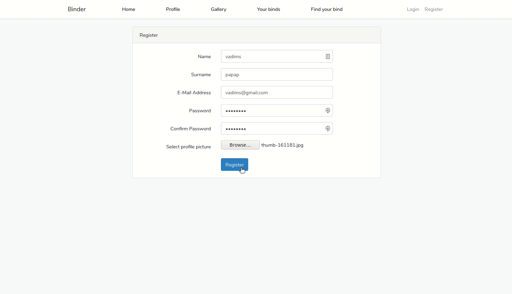

# Find your bind

Pet project built to get more familiar with laravel framework. 
This is something like tinder web version.

## Example

## Usage

First configure ``.env `` file to connect to your database 

Next step is to run `` composer install``  

Then run ``php artisan migrate``   and
``php artisan db:seed`` to fill data

Final step is to run local development server:  
``php artisan serv``

Register and try it!  

There will be v2 in the future.

